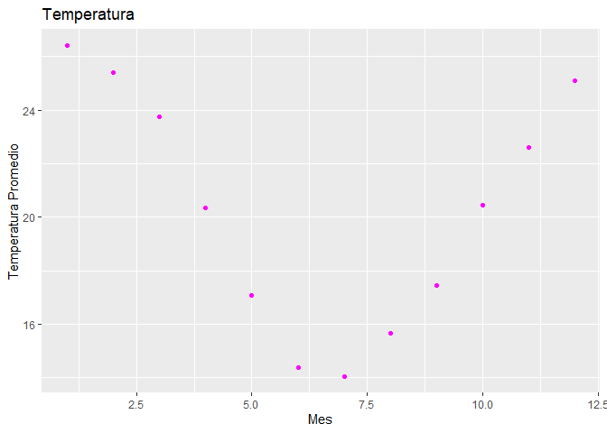

<!-- README.md is generated from README.Rmd. Please edit that file -->

# datosclima

<!-- badges: start -->
<!-- badges: end -->

El objetivo de datosclima es aprender a desarrollar paquetes con RStudio

## Instalacion

Podes instalar la version de desarrollo de datosclima desde
[GitHub](https://github.com/) con:

``` r
# install.packages("pak")
pak::pak("juanasacco/datosclima")
```

## Ejemplo

Aqui mostramos ejemplos basicos de como resolver problemas relacionados
a nuestras funciones:

- Con la funcion `lectura_estaciones()`:

``` r
library(datosclima)

NH0437 <- suppressMessages(lectura_estaciones("NH0437", "~/prueba_paquete"))
```

- Con la funcion `grafico_temperatura_mensual()`:

``` r
grafico_temperatura_mensual(NH0437,color = "magenta")
```



- Con la funcion `tabla_resumen_temperatura()`:

``` r

suppressMessages(tabla_resumen_temperatura(NH0437))
#> # A tibble: 7 × 2
#> # Groups:   id [1]
#>   id     resumen_temp
#>   <chr>  <table[1d]> 
#> 1 NH0437   2.10000   
#> 2 NH0437  16.00000   
#> 3 NH0437  21.00000   
#> 4 NH0437  20.23105   
#> 5 NH0437  24.70000   
#> 6 NH0437  36.30000   
#> 7 NH0437 191.00000
```
